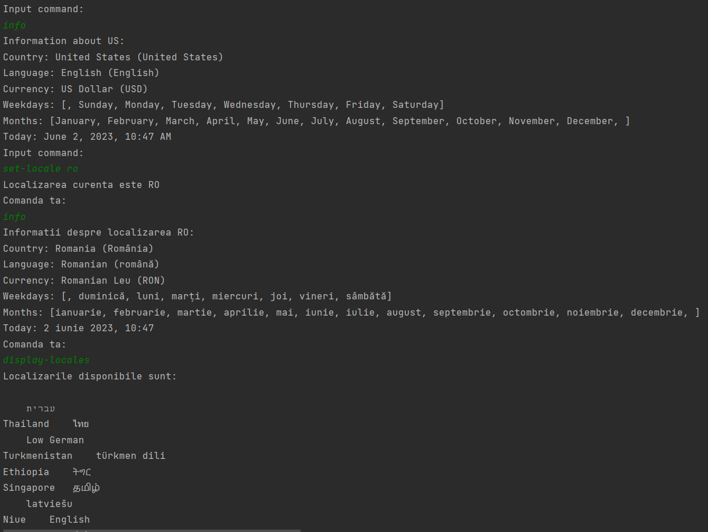

# Thirteenth_Laboratory

:adult: **Alexandru Neagu** from **2B2** (transferred from **2A6**).

This repository contains solutions for:

## Thirteenth Laboratory ##

:white_check_mark: **Compulsory** - **all bullets** completed

## Compulsory Part ##

:heavy_check_mark: Created a package with the name **resources**. Inside this package created the files: _Messages.properties_, _Messages_ro.properties_.
- _:card_index_dividers: src/main/resources_

:heavy_check_mark: Created the package **ro** and implemented the following classes describing commands:
  - **DisplayLocales**: to display all available locales
  - _:file_folder: src/main/java/ro/command/DisplayLocalesCommand.java_
  - **SetLocale**: to set the application current locale.
  - _:file_folder: src/main/java/ro/command/SetLocaleCommand.java_
  - **Info**: to display informations about the current or a specific locale.
  - _:file_folder: src/main/java/ro/command/InfoCommand.java_

:heavy_check_mark: Created the package the main class **LocaleExplore** that uses an instance of the **Shell** class. The Shell class is responsible for reading commands from the keyboard and executing them.
- _:file_folder: src/main/java/ro/shell/Shell.java_
- _:file_folder: src/main/java/ro/LocaleExplorer.java_

:heavy_check_mark: All the locale-sensitive information are translated in at least two languages (english-default and romanian), using the resource files.

:pushpin: **Commands**

