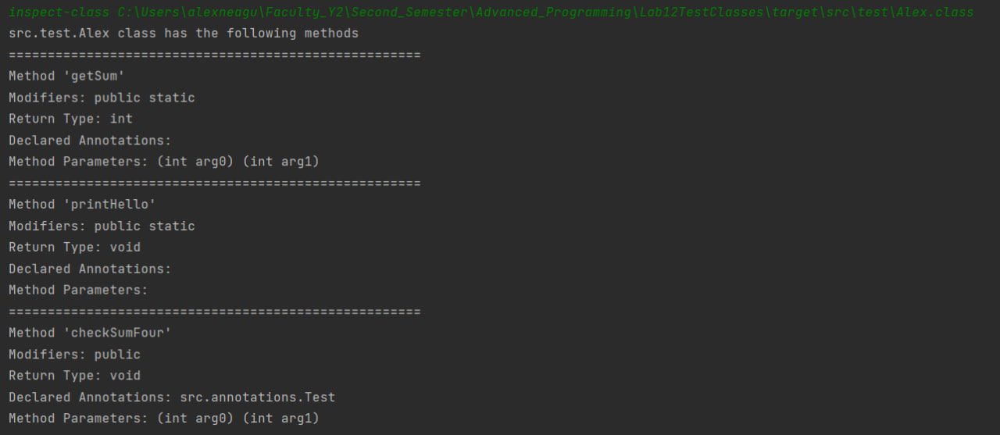
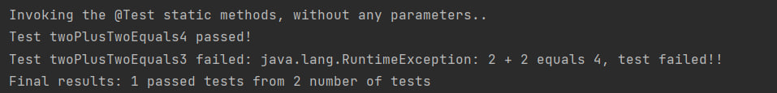
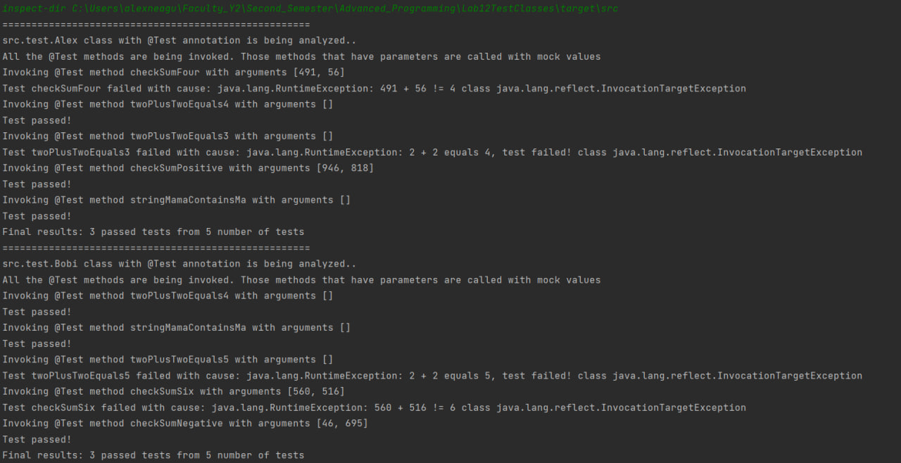
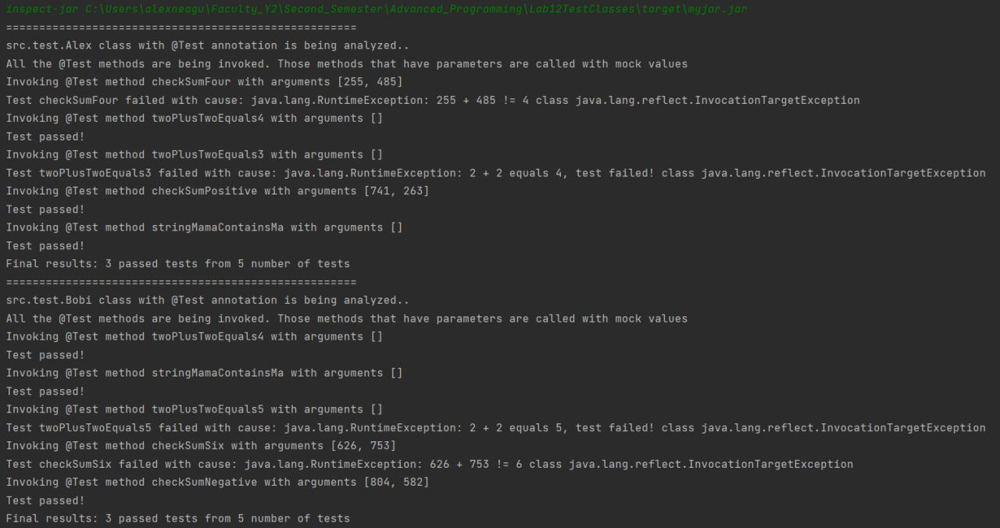
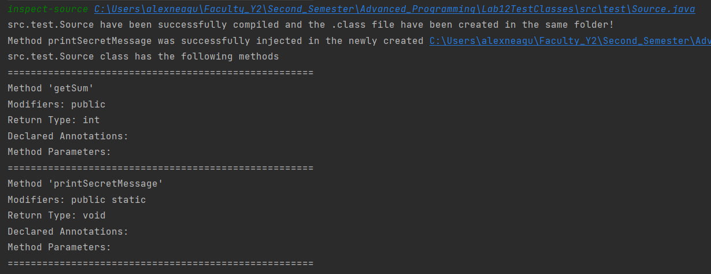

# Twelfth_Laboratory

:adult: **Alexandru Neagu** from **2B2** (transferred from **2A6**).

This repository contains solutions for:

## Twelfth Laboratory ##

:white_check_mark: **Compulsory** - **all bullets** completed

:white_check_mark: **Homework** - **all bullets** completed

:white_check_mark: **Bonus** - **all bullets** completed

## Compulsory Part ##

:heavy_check_mark: Create an application to analyze and test java classes. Created a **shell** that interacts with the user.
- _:card_index_dividers: src/main/java/ro/shell_
- _:file_folder: src/main/java/ro/command/InspectClassCommand.java_

:heavy_check_mark: The input is a .class file, located anywhere in the file system.

:heavy_check_mark: Loaded the specified class in memory, identifying its package dynamically.
- _:file_folder: src/main/java/ro/util/PathUtils.java_

:heavy_check_mark: Updated pom.xml, in order to add the database driver to the project libraries.

:heavy_check_mark: Used reflection in order to extract information about the methods from the class.
- _:file_folder: src/main/java/ro/util/ClassAnalysis.java_

:heavy_check_mark: Used reflection in order to invoke the static methods, with no arguments, annotated with @Test.
- _:file_folder: src/main/java/ro/command/InspectClassCommand.java_
- _:file_folder: src/main/java/ro/util/ClassAnalysis.java_

:pushpin: **InspectClass Called**

:pushpin: **Test Method Invocation**

## Homework Part ##

:heavy_check_mark: Added support for _.class_ files extracted from a **folder** or a  **.jar** (by doing a recursive traversal)
- _:card_index_dividers: src/main/java/ro/command/InspectDirCommand.java_
- _:card_index_dividers: src/main/java/ro/command/InspectJarCommand.java_

:heavy_check_mark: Identified all public classes annotated with @Test and invoked the methods annotated with @Test, whether static or not.
- _:file_folder: src/main/java/ro/util/ClassAnalysis.java_

:heavy_check_mark: If a method requires int or String arguments, mock values are generated for them.

:heavy_check_mark: Printed statistics regarding the tests.
- _:file_folder: src/main/java/ro/util/ClassAnalysis.java_

:pushpin: **InspectDir Called**

:pushpin: **InspectJar Called**

## Bonus Part ##

:heavy_check_mark: Considered the case when the input files are _.java_ files. I compiled the source code before analyzing the input file.
- _:file_folder: src/main/java/ro/command/InspectSourceCommand.java_

:heavy_check_mark: Used **BCEL** bytecode manipulation framework in order to extract the bytecode of the class and perform bytecode instrumentation. Injected a mock method in the class and tested it afterwards.
- _:file_folder: src/main/java/ro/util/MockInjector.java_

:pushpin: **InspectSource Called**

